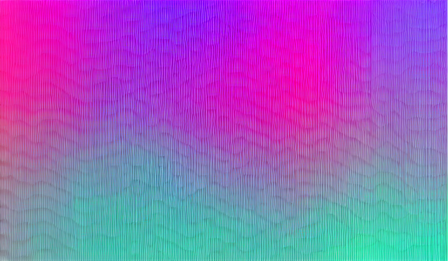

# gradflow



Simple and lightweight neural network library with a pytorch-like API.

### Installation

```bash
git clone https://github.com/1sanch0/gradflow.git
cd gradflow
pip install -e .
```

### Example

Gradflow has a built-in autograd engine that suports several operations, here it shows some of them:

```python3
from gradflow import Tensor

a = Tensor(2.0, requires_grad=False)
b = Tensor(2.0, requires_grad=False)
c = a * b
c.requires_grad = True
d = Tensor(2.0, requires_grad=False)
e = c * d
f = Tensor(2.0, requires_grad=False)
g = e * f
h = Tensor(2.0, requires_grad=True)
i = g / h
j = i.log()
k = j + h
l = k * i
m = k.exp()
m.backward()
print(m)      # 59.1124
print(c.grad) # 14.7781
print(h.grad) # 29.5562
```

### Neural networks

An autograd engine is basically all you need to create neural networks plus some other functions:

Snippet from `examples/mnist.ipynb`:

```python3
from gradflow.model import Model
import gradflow.functions as F
from gradflow.optim import Adam

class Net(Model):
  def __init__(self):
    super().__init__()

    self.dense0 = F.Linear(28*28, 16)
    self.relu = F.ReLU()
    self.dense1 =  F.Linear(16, 10)
    self.logsoftmax = F.LogSoftmax(dim=-1)
  
  def forward(self, x) -> Tensor:
    out = self.dense0(x)
    out = self.relu(out)
    out = self.dense1(out)
    return self.logsoftmax(out)

model = Net()
criterion = F.NLLLoss(indexed=False)
optimizer = Adam(model.parameters(), lr=0.001, weight_decay=0.001)

# training loop:
  optimizer.zero_grad()

  outputs = model(data)
  loss = criterion(outputs, labels)

  loss.backward()

  optimizer.step()
```

## API

TODO
